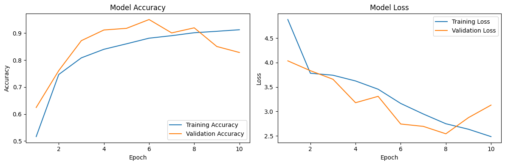

# Fruits-360 Image Classification Project

## **Author**  
Touseef Asif

---

## **Project Description**  

This project focuses on the classification of fruit images from the popular **Fruits-360 dataset**. Using a **Convolutional Neural Network (CNN)** implemented in TensorFlow/Keras, the model achieves high accuracy in recognizing and classifying 141 different types of fruits. The project demonstrates key principles of deep learning, including data preprocessing, augmentation, model training, and evaluation.

---

## **Table of Contents**

1. [Project Description](#project-description)  
2. [Dataset Details](#dataset-details)  
3. [Installation and Setup](#installation-and-setup)  
4. [Model Architecture](#model-architecture)  
5. [Training and Validation](#training-and-validation)  
6. [Results](#results)  
7. [Usage](#usage)  
8. [Acknowledgements](#acknowledgements)  

---

## **Dataset Details**  

The **Fruits-360 Dataset** is publicly available and consists of the following:  
- **Training Set**: Contains images of 141 different fruit classes.  
- **Validation Set**: Contains test images to validate the model.  

The dataset includes a diverse set of fruits and variations in color, shape, and texture.  
[Dataset Link](https://www.kaggle.com/moltean/fruits)

---

## **Installation and Setup**  

### Prerequisites  
Ensure you have the following installed:  
- Python 3.8+  
- TensorFlow 2.9+  
- Required libraries: NumPy, Matplotlib, SciKit-Learn  

### Installation Steps  
1. Clone the repository:  
    ```bash
    git clone https://github.com/your-username/fruits-360-classification.git
    cd fruits-360-classification
    ```
2. Install required dependencies:  
    ```bash
    pip install -r requirements.txt
    ```

3. Download the Fruits-360 dataset and place it in the appropriate directories:  
    - `fruits_dataset/Training`  
    - `fruits_dataset/Test`  

4. Run the training script:  
    ```bash
    python train.py
    ```

---

## **Model Architecture**  

The **Convolutional Neural Network (CNN)** was designed with the following structure:  

1. **Input Layer**: Reshapes images to 100x100 pixels.  
2. **Convolutional Layers**:  
    - 3 convolutional layers with `ReLU` activation and Batch Normalization.  
    - MaxPooling layers to reduce spatial dimensions.  
3. **Fully Connected Layers**:  
    - Dense layers with 256 neurons, Dropout to reduce overfitting.  
4. **Output Layer**:  
    - Dense layer with 141 neurons (softmax activation) for multi-class classification.  

**Loss Function**: Categorical Crossentropy  
**Optimizer**: Adam  

---

## **Training and Validation**  

The model was trained using **data augmentation** and **class weights** to handle class imbalance. Training details:  

- **Epochs**: 10  
- **Batch Size**: 32  
- **Steps per Epoch**: Dynamically calculated based on dataset size.  
- **Callbacks Used**:  
    - EarlyStopping (to prevent overfitting)  
    - ReduceLROnPlateau (to dynamically adjust learning rate)  
    - ModelCheckpoint (to save the best-performing model)  

---

## **Results**  

Below are the accuracy and loss graphs obtained after training for 10 epochs:

### Model Performance
- **Validation Accuracy**: ~91%  
- **Training Accuracy**: ~91%  
- **Validation Loss**: ~2.54  

### Accuracy and Loss Graphs  


---

## **Usage**  

### Training the Model  
To train the model with your dataset, update the dataset paths in the code and run:  
```bash
python train.py

from tensorflow.keras.preprocessing import image
import numpy as np

# Load and preprocess an image
img = image.load_img("path_to_image.jpg", target_size=(100, 100))  
img_array = image.img_to_array(img) / 255.0  
img_array = np.expand_dims(img_array, axis=0)  

# Load the trained model
from tensorflow.keras.models import load_model
model = load_model("final_model.h5")

# Predict the class
predictions = model.predict(img_array)
predicted_class = np.argmax(predictions)
print(f"Predicted Class: {predicted_class}")
